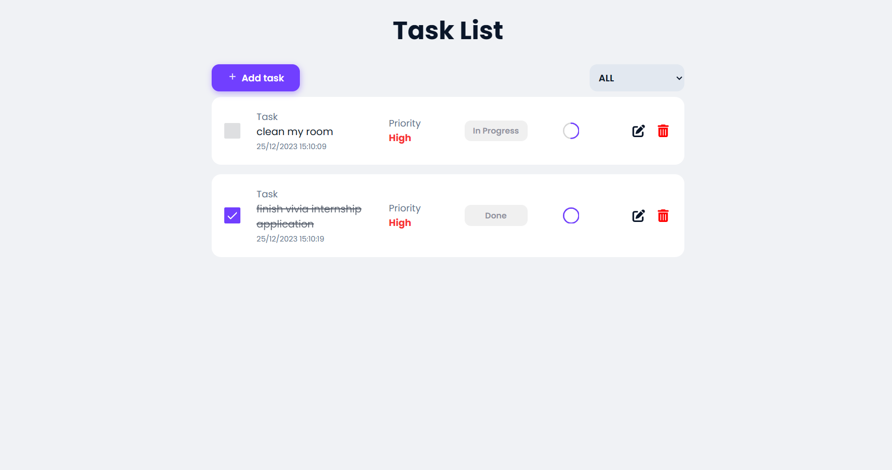
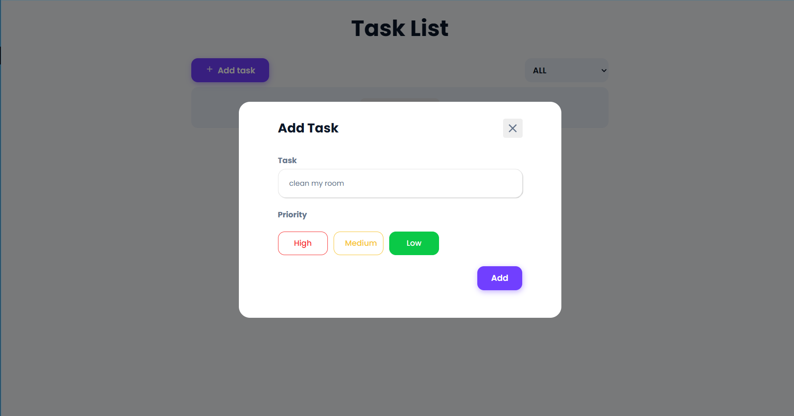
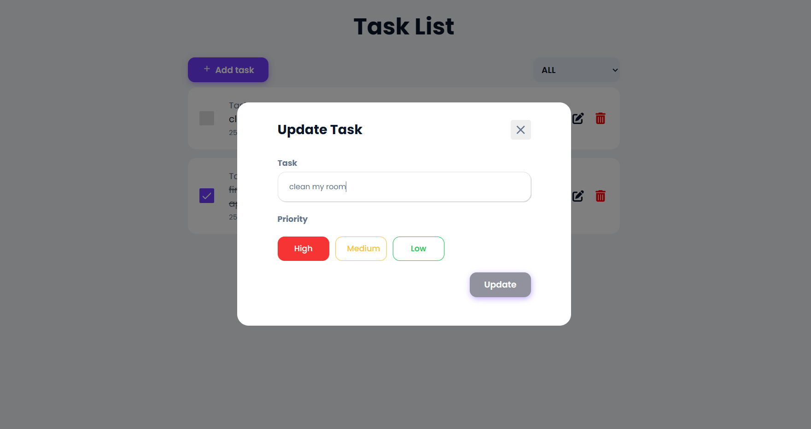

# React-todolist

## A to-do list web app for an internship application.

## 
## 
## 

---

### Frontend

#### Technologies Used:

-[React](https://reactjs.org/) -A declarative, efficient, and flexible JavaScript library for building user interfaces.

-[Redux Toolkit](https://redux-toolkit.js.org/) - A set of tools to simplify the logic of managing state in React applications.

-[TypeScript](https://www.typescriptlang.org/)-A strict syntactical superset of JavaScript, adding static typing for enhanced code quality.

-[Framer Motion](https://www.framer.com/motion/) - A production-ready motion library for React, used for creating smooth animations.

### Project Structure:

- **src/components:** Contains reusable React components.
- **src/app:** Manages the state of the application using Redux Toolkit.
- **src/features:** Manages todo slices using Redux Toolkit
- **app/models:** Defines models for interacting with the frontend data.
- **app/styles:** Contains styles for the frontend components.
- **app/types:** Defines types for the frontend.
- **app/utils:** Utility functions for the frontend.

## Project structure

### Getting Started:

1. Clone the repository:
   ```bash
   git clone https://github.com/sirine-zanina/React-todo.git
   ```
2. Install dependencies:
   ```bash
   cd React-todo/
   npm  install
   ```
3. Run the development server
   ```BASH
   npm start
   ```

---

### Backend

#### Technologies Used:

-[Node.js](https://nodejs.org/) -A JavaScript runtime built on Chrome's V8 JavaScript engine.

-[Express.js](https://expressjs.com/) -A minimal and flexible Node.js web application framework.

-[Sequelize](https://sequelize.org/) -A promise-based Node.js ORM for Postgres, MySQL, MariaDB, SQLite, and Microsoft SQL Server.

-[PostgreSQL](https://www.postgresql.org/) -A powerful, open-source relational database system.

### Getting Started:

1. Install dependencies:

   ```bash
   cd React-todo/server
   npm install

   ```

### Database Setup:

1. Install PostgreSQL: Follow the instructions on the [PostgreSQL website](https://www.postgresql.org/download/) to install and set up PostgreSQL on your machine.
2. Configure Database Connection:
   - Open `React-todo/server/database.js`.
   - Update the configuration with your PostgreSQL database credentials.
